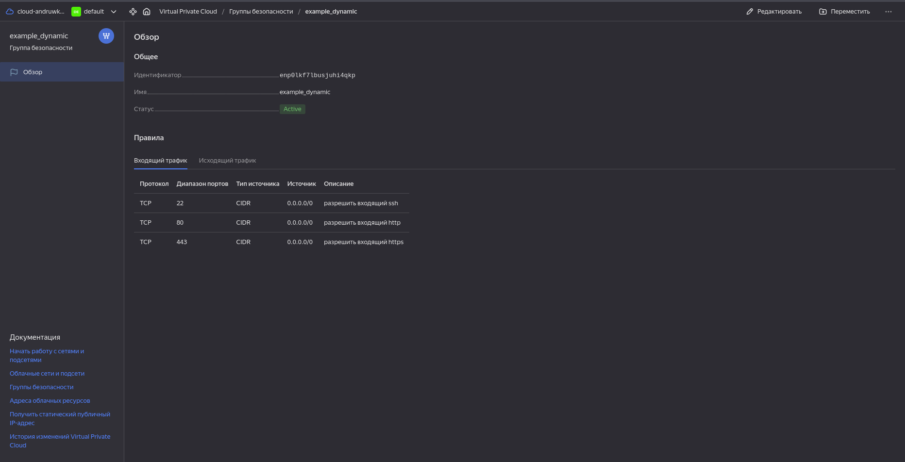
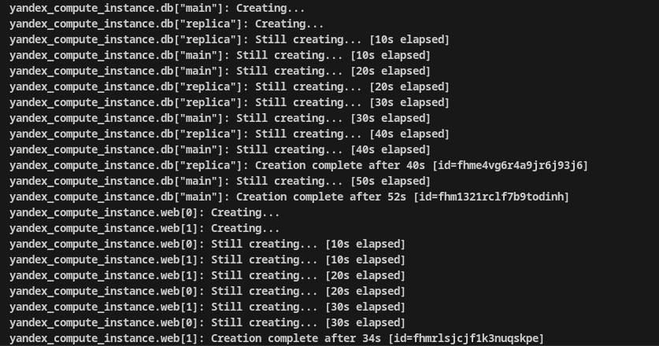
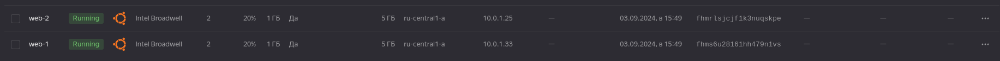
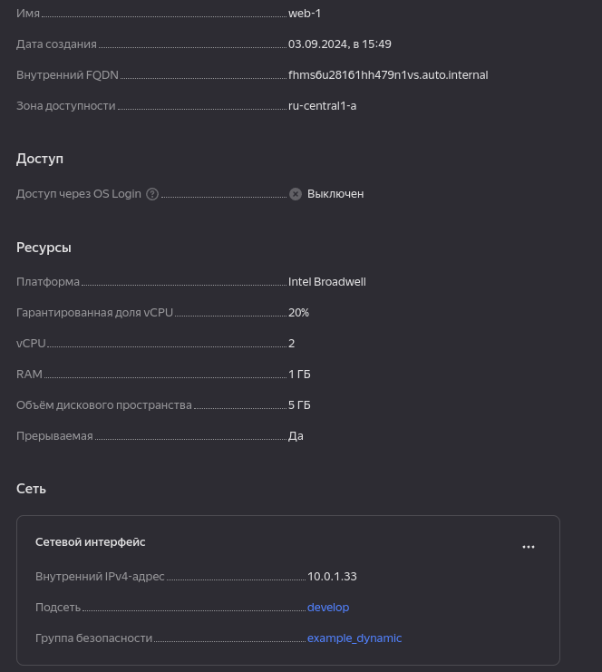
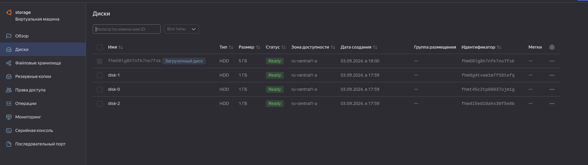
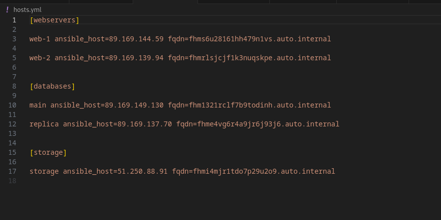

# Управляющие конструкции в коде Terraform

## Задание 1.
Скриншот входящих правил «Группы безопасности».


## Задание 2.
- Сначало создаютя ВМки бд, а после ВМки вэб

- Имена ВМок вэб 1 и вэб 2, а так же входят в созданную ранее группу безопастности 



### count-vm.tf:
```
resource "yandex_compute_instance" "web" {
  depends_on = [yandex_compute_instance.db]

  count = var.counts

  name        = "${var.vms_name}-${count.index + 1}"
  platform_id = var.vms_resources.platform_id

  resources {
    cores         = var.vms_resources.cores
    memory        = var.vms_resources.memory
    core_fraction = var.vms_resources.core_fraction
  }

  boot_disk {
    initialize_params {
      image_id = data.yandex_compute_image.ubuntu.image_id
      type     = var.vms_resources.disk_type
      size     = var.vms_resources.disk_size
    }
  }

  metadata = {
    serial-port-enable = 1
    ssh-keys           = local.ssh_key
  }

  scheduling_policy { preemptible = var.vms_resources.preemptible }

  network_interface {
    subnet_id = yandex_vpc_subnet.develop.id
    security_group_ids = [yandex_vpc_security_group.example.id]
  }
  allow_stopping_for_update = true
}
```
### for_each-vm.tf:

```
resource "yandex_compute_instance" "db" {
  for_each = {
    main = var.each_vm[0]
    replica = var.each_vm[1]
  }
  name        = "${each.value.vm_name}"
  platform_id = var.vms_resources.platform_id


  resources {
    cores         = "${each.value.cpu}"
    memory        = "${each.value.ram}"
    core_fraction = var.vms_resources.core_fraction
  }

  boot_disk {
    initialize_params {
        image_id = data.yandex_compute_image.ubuntu.image_id
        type     = var.vms_resources.disk_type
        size     = "${each.value.disk_volume}"
    }
  }

  metadata = {
    serial-port-enable = 1
    ssh-keys           = local.ssh_key
  }

  scheduling_policy { preemptible = var.vms_resources.preemptible }

  network_interface {
    subnet_id = yandex_vpc_subnet.develop.id
    nat = var.vms_resources.nat
  }
  allow_stopping_for_update = true
}
```
### locals.tf:
```
locals {
   ssh_key = file("~/.ssh/id_ed25519.pub")
}

```

## Задание 3.
Создал 3 одинаковых диска

```
resource "yandex_compute_disk" "disks" {
  count = 3

  name     = "disk-${count.index}"
  type     = var.disks_resources.disk_type
  size     = var.disks_resources.disk_size
}
```

Также создал ВМ storage и добавил эти 3 диска с помощью dynamic secondary_disk

```
resource "yandex_compute_instance" "storage" {
  name        = var.vms_name_storage
  depends_on = [ yandex_compute_disk.disks ]
  platform_id = var.vms_resources.platform_id

  resources {
    cores         = var.vms_resources.cores
    memory        = var.vms_resources.memory
    core_fraction = var.vms_resources.core_fraction
  }
  boot_disk {
    initialize_params {
      image_id = data.yandex_compute_image.ubuntu.image_id
    }
  }
  dynamic secondary_disk {
    for_each = yandex_compute_disk.disks[*].id
      content {
        disk_id = secondary_disk.value
      }
  }
  metadata = {
    serial-port-enable = 1
    ssh-keys           = local.ssh_key
  }

  scheduling_policy { preemptible = var.vms_resources.preemptible }

  network_interface {
    subnet_id = yandex_vpc_subnet.develop.id
  }
  allow_stopping_for_update = true
}
```


## Задание 4.

Для корректной работы пришлось в yandex_compute_instance storage добавить  ``` count = 1 ```, а так же в предыдущих заданиях забыл добавить параметр nat в yandex_compute_instance's storage и web, для корректного отображения адресса в инвентори файле добавил эти параметры.
### ansible.tf:

```
resource "local_file" "inventory" {
    filename = "./hosts.yml"
    content = templatefile("./ansible.tftpl", {
        webservers = yandex_compute_instance.web,
        databases = yandex_compute_instance.db,
        storage = yandex_compute_instance.storage
    })
}
```
Шаблон 
### ansble.tftpl:

```
[webservers]
%{for i in webservers }
${i["name"]} ansible_host=${i["network_interface"][0]["nat_ip_address"]} fqdn=${i["fqdn"]}
%{endfor}

[databases]
%{for i in databases }
${i["name"]} ansible_host=${i["network_interface"][0]["nat_ip_address"]} fqdn=${i["fqdn"]}
%{endfor}

[storage]
%{for i in databases }
${i["name"]} ansible_host=${i["network_interface"][0]["nat_ip_address"]} fqdn=${i["fqdn"]}
%{endfor}
```
Выходной файл
### host.yaml:

